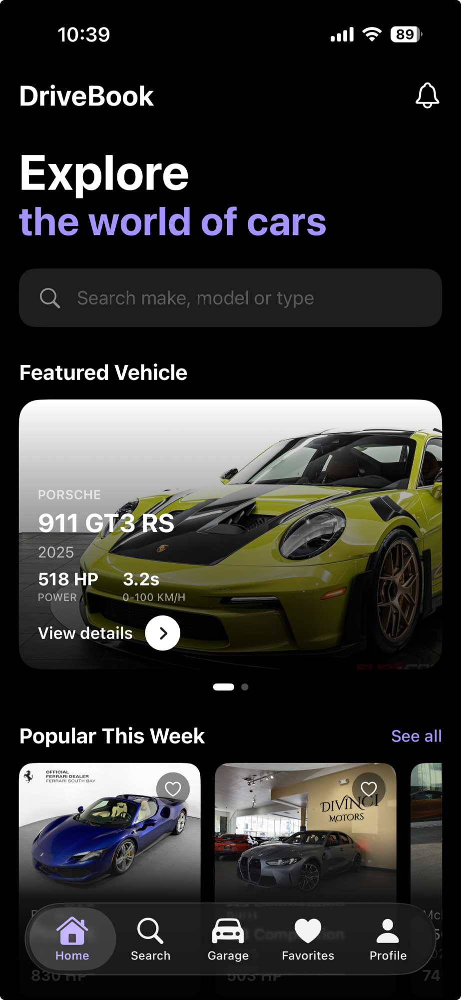
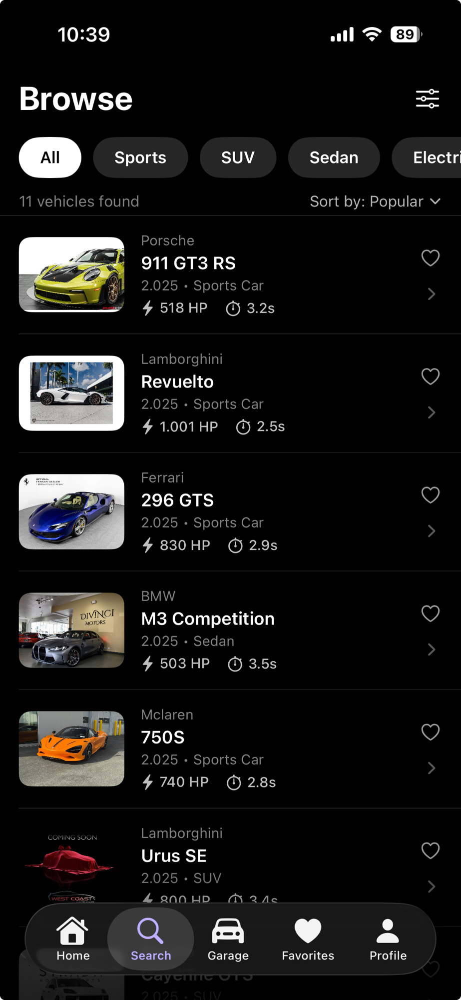
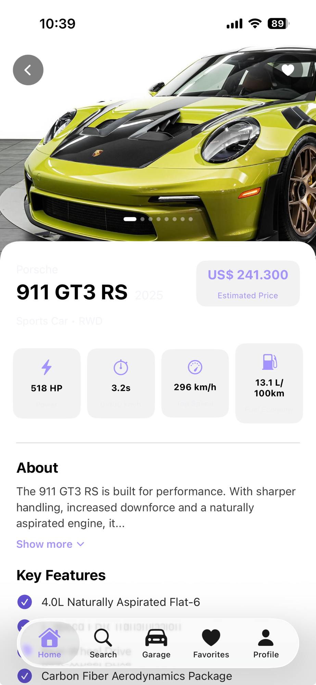
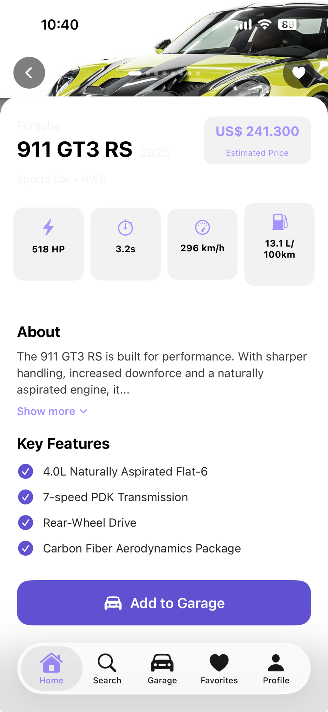
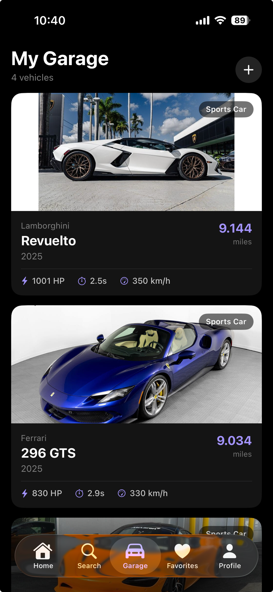
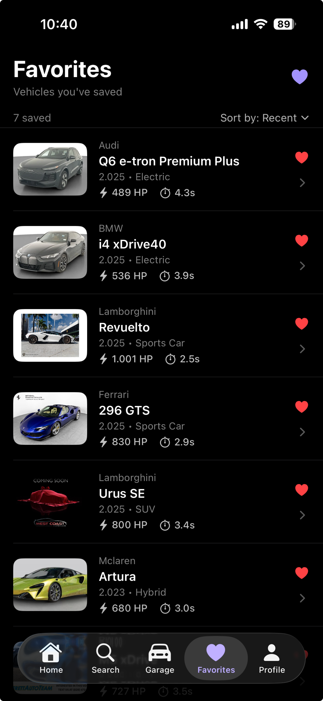
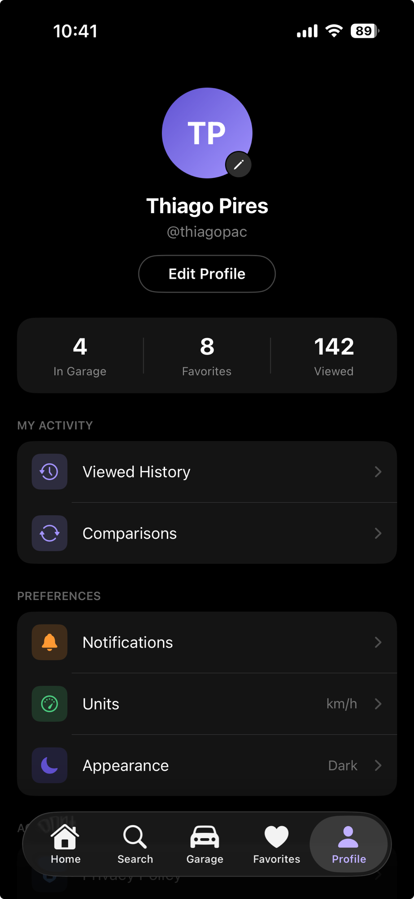

# DriveBook

A car discovery app for iOS. Browse vehicles, view specs and photos, save to garage, and manage favorites.

## Screenshots

<table>
  <tr>
    <td></td>
    <td></td>
    <td></td>
    <td></td>
  </tr>
  <tr>
    <td align="center">Home</td>
    <td align="center">Browse</td>
    <td align="center">Detail</td>
    <td align="center">Detail (scrolled)</td>
  </tr>
  <tr>
    <td></td>
    <td></td>
    <td></td>
    <td></td>
  </tr>
  <tr>
    <td align="center">Garage</td>
    <td align="center">Favorites</td>
    <td align="center">Profile</td>
    <td></td>
  </tr>
</table>

## Tech stack

| | |
|---|---|
| Language | Swift 5 (Xcode 26, Swift 6 concurrency features enabled) |
| UI | SwiftUI |
| Minimum deployment | iOS 26.5 |
| State management | `@Observable` macro (iOS 17+) |
| Networking | `URLSession` async/await, no third-party libraries |
| Navigation | `NavigationStack` + `NavigationLink(value:)` + `.navigationDestination(for:)` |

## Architecture

The project follows MVVM. Views live in `pages/` (full screens) and `Views/` (reusable components). Each screen has a dedicated ViewModel where needed.

A few decisions worth noting:

**`@Observable` instead of `ObservableObject`**  
Adopted the newer `@Observable` macro, which tracks only the properties actually read during a given render, avoiding unnecessary view updates.

**`SWIFT_DEFAULT_ACTOR_ISOLATION = MainActor`**  
All types in the target are implicitly `@MainActor`. This removes the need to annotate ViewModels explicitly and keeps UI updates safe without manual `DispatchQueue.main` calls.

**`SWIFT_APPROACHABLE_CONCURRENCY = YES`**  
Xcode 26 concurrency mode. Enables stricter actor-isolation checks at compile time.

**`SWIFT_UPCOMING_FEATURE_MEMBER_IMPORT_VISIBILITY = YES`**  
Foundation types (`NumberFormatter`, `NSNumber`) require an explicit `import Foundation` — they are no longer implicitly available through SwiftUI's re-exports.

**`PBXFileSystemSynchronizedRootGroup`**  
All Swift files under `DriveBook/` are auto-included in the build target. No manual file registration needed in the project.

**Parallel data fetching**  
Home screen fetches featured vehicles, popular vehicles, and brands concurrently using `async let`.

**Skeleton loading**  
Each tab renders animated placeholder blocks while data is loading, replacing the common pattern of showing a spinner over a blank screen.

**Parallax photo header**  
The vehicle detail screen uses a `GeometryReader` inside the `ScrollView` to read the current scroll offset and apply a reduced offset to the photo layer, so the card slides over the photo at a faster rate than the photo itself moves.

## Backend

The backend is a set of static JSON files in `backend/api/v1/`, hosted on GitHub and served via raw content URLs. The app treats them as a read-only REST API. This simulates real network behavior (latency, caching) without requiring a running server.

```
backend/api/v1/
  home/featured.json
  home/popular.json
  home/brands.json
  browse/{all,sports,suv,sedan,electric,hybrid}.json
  vehicles/{vin}/detail.json
  vehicles/{vin}/photos.json
```

`APIService` is a `enum` with static `async throws` methods, one per endpoint.

## Project structure

```
DriveBook/
  Models/          — Codable data models
  Services/        — APIService
  ViewModels/      — HomeViewModel, BrowseViewModel
  Views/           — Reusable components and skeleton views
  pages/           — Full-screen views (HomeView, BrowseView, VehicleDetailView, …)
```
